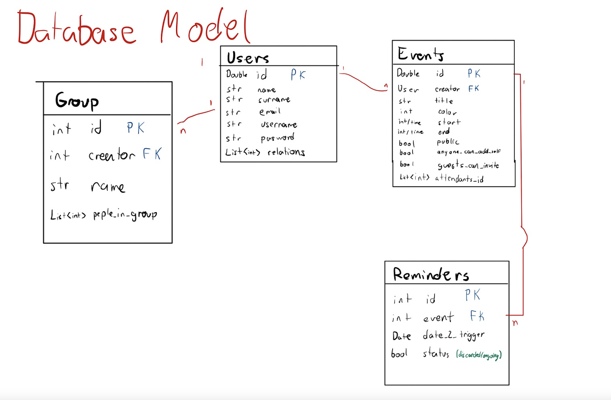

# ScheduleIn
A calendar tool where you can also follow your friends, colleges and families allowing user to view partners schedule and schedule joined events. app should also provide real time details (if users allow it) to let somebody know where you are and if you are available at the moment

## Table of Contents
1. [Overview](#Overview)
1. [Product Spec](#Product-Spec)
1. [Wireframes](#Wireframes)
2. [Schema](#Schema)

## Overview
### Description
ScheduleIn is an app that aims to improve current calendar tools allowing the user to follow his friends, colleges and families in order to view partners aviability and to provide an easy way to create joined events, the user can also create gruops with other users which whom we usually hangs out with like family, work teams, etcetera and this will allow user easily create group events.

### App Evaluation
- **Category:** Productivity, Social, communications, tools 
- **Mobile:** This app will be developed initialy as a mobile app, however I consider that in the future the app should be responsive enough to give confort and practicity in tablets as well, on the other hand a webapp might be developed in the future as well.
- **Story:** Allows user to orginize their time considering their peers time as well 
- **Market:** App's main target are companies and asociations, we want to allow them to improve their logistics and to have a clear scheduling
- **Habit:** The user has total freedom to decide weather they want to register the tasks they will be doing or not, but the app will be much more useful with a constant usage.
- **Scope:** Despite of the fact that the main target are the companies and executives, app will be open for anybody in the word.

## Product Spec

### 1. User Stories (Required and Optional)
**Required User stories:**

* User can login with specific credentials
* User can log-out
* User can sign up
* User can view his week schedule on log in
* User can add events to his schedule
* User is able to have a detailed view of a certain event
* User can Create, Read, Update and Delete an event
* User can view the week view of his calendar at double tap in the main activity (add grow animation)
* User can look for other users using the search bar
* User can see his schedule in month, week and day views
* User can relate with other users
* Once user is related with someone he can see a private view of the other person schedule
* User can Login with google
* User can see his notifications (reminders for next events) and his relations requests
* User can discard his notifications and relate requests swiping right (does this counts as a gesture?)
* User can cancel his next event with a shortcut button
* User can CRUD his relations

**Optional user stories:**
* User is able to link his calendar with google calendar
* User can choose if a certain event is private or public to his friends (when public the other user will be allowed to see the details of the event)
* User can create joined events (of 2 people) in an easy manner
* User can create groups of people which whom he usually hangs, store this groups and create events with the people whitin such groups
* User can look for app features using the search bar

**NOTES:**
* Add swipe animation to the menu activity
* Use glide to add curved borders to profile picture

### 2. Screen Archetypes

* Login or sign up
* Login - 
    * User can login with specific credentials
    * User is able to link his calendar with google calendar
* Register - User signs up 
* User ProfileView -
    * User can view his week schedule on log in
    * User can add events to his schedule
    * User can cancel his next event with a shortcut button
    * User can view the week view of his calendar at double tap in the main activity (add grow animation)
    * User can look for other users using the search bar
* Edit profile -
* Menu -
    * User can see his schedule in month, week and day views
* Notifications -
    * User can see his notifications (reminders for next events) and his relations requests
* Create/update event - 
    * User can Create, Read, Update and Delete an event
* General ProfileView -
    * User can relate with other users
    * Once user is related with someone he can see a private view of the other person schedule
* calendar view (day, week, month)
    * User can see his schedule in month, week and day views
* User relations
* User groups
    * User can create joined events (of 2 people) in an easy manner
    * User can create groups of people which whom he usually hangs, store this groups and create events with the people whitin such groups
    * User can CRUD his relations

### 3. Navigation

**Tab Navigation** (Tab to Screen)

* [Menu when optimized]

**Flow Navigation** (Screen to Screen)


## Wireframes


### [BONUS] Digital Wireframes & Mockups

### [BONUS] Interactive Prototype


## Schema 
### Models
#### Database Model:

#### Java objects:


### Networking
##### Network request for this week events:
```java
        // specify what type of data we want to query
        ParseQuery<Post> query = ParseQuery.getQuery(Event.class);
        // include data referred by user key
        query.include(Post.KEY_USER);
        query.whereGreaterThan("start", current_monday_morning);
        query.whereLessThan("start", current_sunday_night);
        // start an asynchronous call for posts
        query.findInBackground(new FindCallback<Post>() {
            @Override
            public void done(List<Post> posts, ParseException e) {
                // check for errors
                if (e != null) {
                    Log.e(TAG, "Issue while retriving events", e);
                    return;
                }

                // for debugging purposes let's print every post description to logcat
                for (Post post : posts) {
                    weekCalendar = new WeekCalendar(events);
                }
            }
        });
```
... Other requests ...

- [OPTIONAL: List endpoints if using existing API such as Yelp]
Instead of providing specific endpoints to make requests to calendar api and sign in with google api, google provides java libraries that allow us to communicate with both APIs
   * Sign in library : https://developers.google.com/identity/sign-in/android/start-integrating
   * Calendar library : https://developers.google.com/calendar/api/quickstart/java

