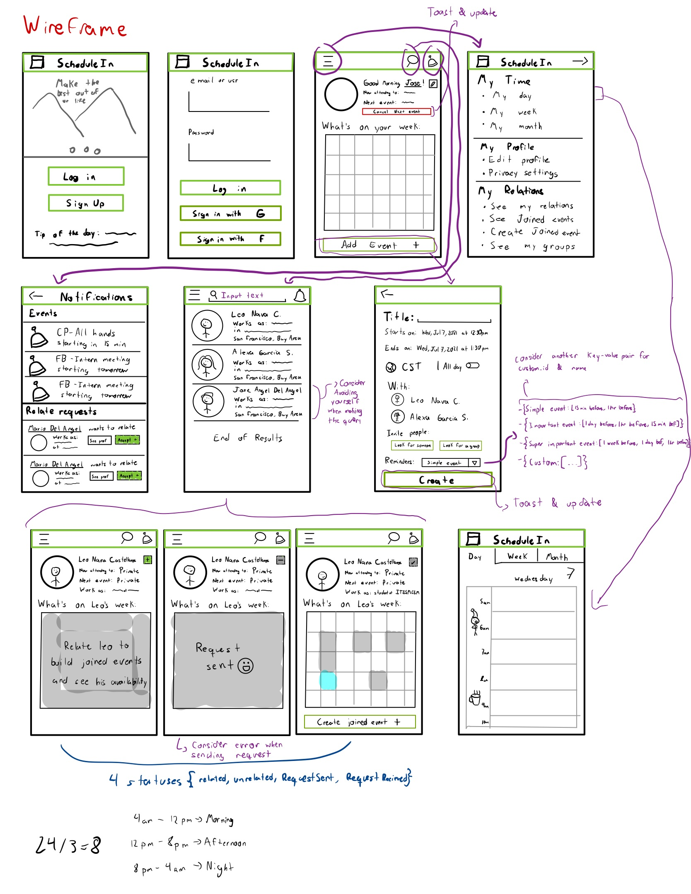

# ScheduleIn
A calendar tool where you can also follow your friends, colleges and families allowing user to view partners schedule and schedule joined events. app should also provide real time details (if users allow it) to let somebody know where you are and if you are available at the moment

## Table of Contents
* [Results](#Results)
  * [Overview video](#overview-video)  
* [App planing](#ScheduleIn-app-planing)
  * [Product Spec](#1-Product-Spec)
  * [Navigation](#2-Product-Spec)
  * [Wireframes](#3-Wireframes)
  * [Interactive Pre-prototype](#4-Interactive-Pre-prototype)
  * [Schema](#5-Schema)
  * [Networking](#6-Networking)
  * [APIs, SDKs and Frameworks used](#7-APIs,-SDKs-and-frameworks-used)

# Results

## Overview video:

### Stories acomplished

   * [x] User can login with specific credentials
   * [x] User can log-out
   * [x] User can sign up
   * [x] User can view his week schedule on log in
   * [x] User can add events to his schedule
   * [x] User is able to have a detailed view of a certain event
   * [x] User can Create, Read, Update and Delete an event
   * [x] User can look for other users using the search bar
   * [x] User can send to other users relate requests
   * [x] User can accept or decline relate requests
   * [x] User can Create, Read, Update and Delete his relations
   * [x] Once user is related with someone he can see a private view of the other user's week schedule
   * [x] User can pinch zoom in the week preview of the home tab to take him to a detailed view of his week
   * [x] User can see his schedule week and day views
   * [x] User can Login with google
   * [x] User can discard his relate requests swiping right
   * [x] User can invite his friends to any event when creating or updating the event
   * [x] User can uninvite friends to an event
   * [x] User can see the events he is invited to
   * [x] When user invites people to an event he can see the availability of the invitees for the day of the event
   * [x] User can see a detailed view of the events he is invited to
   * [x] User can create groups of people which whom he usually hangs
   * [x] User can create events with the people whitin such groups
   * [x] User can Create, Read, Update and Delete his groups
   * [x] App has nice transitions and animations
   * [x] App includes a library that gives visual polish
  
 ### Stories that could improve the app
   * [ ] User is able to link the app with google calendar
   * [ ] User can assign to an event a color
   * [ ] User can assign to a group a color
   * [ ] User can update his profile picture
   * [ ] User can set reminders for events
   * [ ] App makes timing suggestions for new events based in invitees availability 
   * [ ] App uses ML cluster algorithm and NLP to suggest a time for new event based on user habits  
   * [ ] User can choose if a certain event is private or public to his friends (when public the other user will be allowed to see the name of the event but not the details of such event)

# ScheduleIn-app-planing:

### Description
ScheduleIn is an app that aims to improve current calendar tools allowing the user to follow his friends, colleges and families in order to view partners aviability and to provide an easy way to create joined events, the user can also create gruops with other users which whom we usually hangs out with like family, work teams, etcetera and this will allow user easily create group events.

### App Evaluation
- **Category:** Productivity, Social, communications, tools 
- **Mobile:** This app will be developed initialy as a mobile app, however we consider that in the future the app should be responsive enough to give confort and practicity in tablets as well, on the other hand a webapp might be developed in the future as well.
- **Story:** Allows user to orginize their time considering peers time as well 
- **Market:** App's main target are companies and asociations, we want to allow them to improve their logistics and to have a clear scheduling
- **Habit:** The user has total freedom to decide weather they want to register the tasks they will be doing or not, but the app will be much more useful with a constant usage.
- **Scope:** Despite of the fact that the main target are the companies and executives, app will be open for anybody in the word.

## Product Spec:

## 1. Screen Archetypes

* Login or sign up
* Login - 
    * User can login with specific credentials
    * User is able to sign in with google calendar
* Sign up - User signs up 
* User ProfileView -
    * User can view his week schedule on log in
    * User can add events to his schedule
    * User can cancel his next event with a shortcut button [this feature hasn't been implemented yet]
    * User can view the week view of his calendar at pinch zoom in the main activity
    * User can look for other users using the search bar
* Create/update event - 
    * User can Create, Read, Update and Delete an event
* Check Availability -
    * User can check the avilability of the event invitees for the day of the event 
* General ProfileView -
    * User can see other user profile
    * User can send a relate request to other user if he isn't already related
    * User can accept a relate request to other user if he isn't already related
    * Once user is related with someone he can see a private view of the other person week schedule
* Edit profile -
* calendar view (day, week, month)
    * User can see his schedule in week and day views
* User relations
    * User can see the people he is related to 
    * User can unrelate to any user he is related to
    * User can accept or decline relate requests 
* User groups
    * User can see his groups
    * User can tap on his groups to see details and edit them if necessary
    * There is a button to create a new group
* Create/Update group  
    * User can create groups of people which whom he usually hangs 
    * User can add new people to the group or remove group members
    * User can Create, Read, Update and Delete a group 

## 2. Navigation

**Tab Navigation** (Tab to Screen)

* Home
* My time
  * My day
  * My week
  * My month
* My profile
  * Log out
  * Edit Profile
  * Privacy Settings
*  My relations
  * See my relations
  * See my groups    

**Flow Navigation** (Screen to Screen)

## 3. Wireframes

## 4. Interactive Pre-Prototype

## 5. Schema 

### Database Model:

**User entity:**
| Property   | Type         | Description                                                                                                      |
|------------|--------------|------------------------------------------------------------------------------------------------------------------|
| ID         | String       | User unique identifier                                                                                           |
| username   | String       | username                                                                                                         |
| password   | String       | password used for OAuth of the user                                                                              |
| email      | String       | user's email                                                                                                     |
| name       | String       | user's first name                                                                                                |
| surname    | String       | user's family name                                                                                               |
| relations  | List[String] | list that stores the ids of the users whom which the user is related                                             |
| profilePic | File         | user's profile picture                                                                                           |
| googleUser | Boolean      | this element serves as a flag that allows us to determine is the current user was generated using google sign in |

**Event entity:**

| Property  | Type          | Description                                                                          |
|-----------|---------------|--------------------------------------------------------------------------------------|
| ID        | String        | event unique identifier                                                              |
| creator   | Pointer[User] | points to the user that created the event                                            |
| title     | String        | event's title                                                                        |
| startDate | Date          | event's start date                                                                   |
| endDate   | Date          | event's end date                                                                     |
| invitees  | list[String]  | this attribute stores the ids of the users that are invited to a certain event       |
| public    | Boolean       | if this attribute equals true user's friends can see the event name in his week view |

**Group entity:**

| Property | Type          | Description                                                           |
|----------|---------------|-----------------------------------------------------------------------|
| ID       | String        | group's unique identifier                                             |
| creator  | Pointer[User] | points to the user that created the group                             |
| name     | String        | group's name                                                          |
| members  | list[String]  | this attribute stores the ids of the users that are part of the group |

## 6. Networking
**App network requests are handled in the parseDatabaseComms package of the app, this package contains the following classes:**
* EventQueries
* GroupQueries
* RelationRelatedQueries
* UserSearchQueries
* UserSession

## 7. APIs, SDKs and frameworks used
To acomplish app functionality the app uses the following APIs and SDKs
* [Back4app SDK](https://www.back4app.com/)
* [Google sign in SDK](https://developers.google.com/identity/sign-in/android/sign-in)
* [Glide SDK](https://github.com/bumptech/glide)
* [Parceler](https://github.com/johncarl81/parceler)

